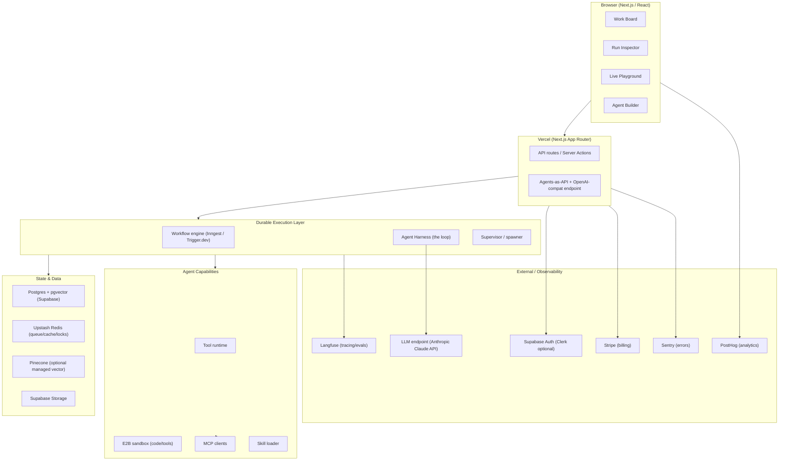
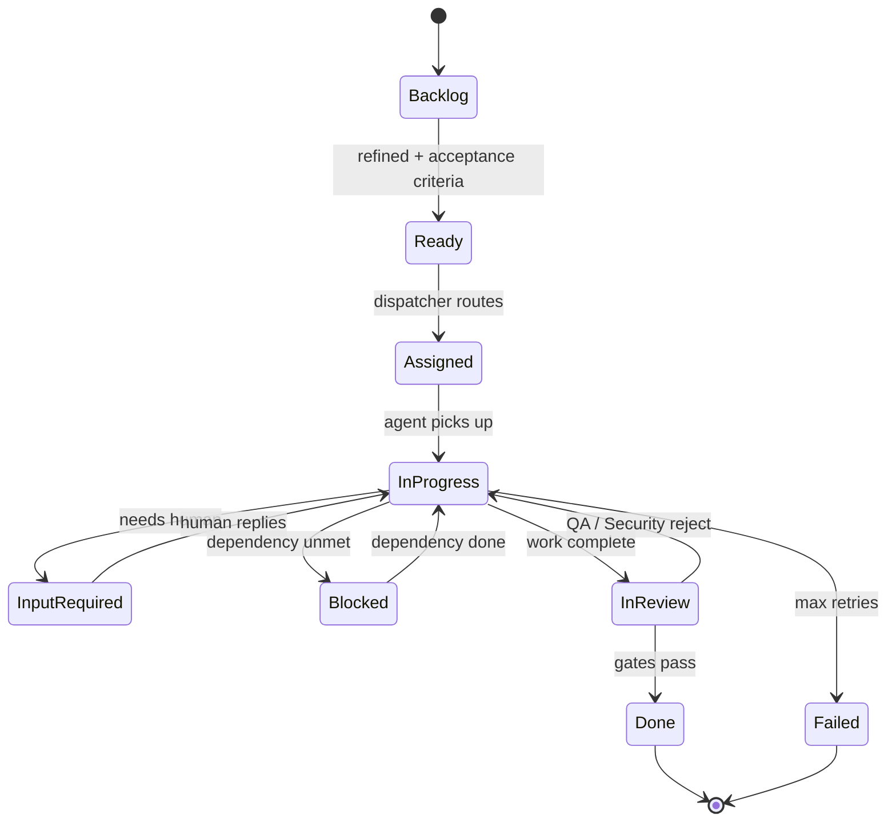

# DevPilot

## Technical Design Document (TDD)

**Version:** 0.1 (Draft — retained as living design-of-record; much of this is implemented)
**Status:** Implemented / living (originally "For review, June 2026"; see `docs/IMPLEMENTATION_STATUS.md` for planned-vs-built)
**Companion to:** DEVPILOT_PRD.md
**Last updated:** June 2026 (status annotations refreshed 2026-07-05)

---

## 1. Architecture Overview

DevPilot is a Next.js app on Vercel, backed by Postgres (Supabase) and a durable-execution engine that runs the actual agent loops. The LLM is the only hard external dependency; it sits behind a model-agnostic adapter so it can be swapped.



**Key idea:** the board, tickets, and agent state all live in Postgres. The durable-execution engine reads/writes that state and drives the harness. Because every step is checkpointed, a run can pause at `Input Required` for hours and resume on a webhook — the "works while offline" guarantee.

---

## 2. Tech Stack (OSS-first)

Every layer prefers open source; paid services are used only where there's no reasonable free/OSS option at MVP scale. The "Founders Pack" services are used as-is.

| Layer                       | Choice                                                     | OSS?  | License / Cost         | Why                                                                                                    |
| --------------------------- | ---------------------------------------------------------- | ----- | ---------------------- | ------------------------------------------------------------------------------------------------------ |
| **Frontend**                | Next.js + React + Tailwind + shadcn/ui                     | ✅    | MIT / Free             | Vercel-native; shadcn is OSS component base                                                            |
| **Hosting**                 | Vercel                                                     | ⚪    | Free tier              | In pack; serverless-native                                                                             |
| **Backend / DB**            | Supabase (Postgres)                                        | ✅    | Apache 2.0 / Free      | In pack; Postgres + Auth + Storage + Realtime + **pgvector** in one                                    |
| **Vector store**            | **pgvector** (primary) / Pinecone (optional)               | ✅/⚪ | Free                   | pgvector = one less dependency; Pinecone in pack as managed fallback                                   |
| **Cache / queue / locks**   | Upstash Redis                                              | ⚪    | Free tier              | In pack; serverless Redis                                                                              |
| **Durable execution**       | **Inngest** (pragmatic) or **Trigger.dev** (OSS self-host) | ⚪/✅ | Free tier / Apache 2.0 | The hard part — see §3.3                                                                               |
| **LLM adapter**             | **Vercel AI SDK**                                          | ✅    | Apache 2.0 / Free      | Provider-agnostic, tool calling, streaming; serves F-INT-06                                            |
| **Execution runners**       | API Runner (AI SDK) + **Claude Agent SDK** local runner    | ✅    | Apache 2.0 / Free      | BYO Claude Pro/Max subscription via `claude -p`; full file/bash/git tools (F-RUN-\*)                   |
| **LLM endpoint**            | Anthropic Claude API                                       | ⚪    | Usage-based            | The one hard dependency; abstracted by AI SDK                                                          |
| **Agent harness**           | Thin custom loop (+ optional Mastra)                       | ✅    | —                      | Keep control; honors "only the LLM endpoint." See §3.2                                                 |
| **Tracing / observability** | **Langfuse** (self-host or cloud free)                     | ✅    | MIT / Free             | OSS LLM-observability leader; OTel-compatible                                                          |
| **Code/tool sandbox**       | **E2B**                                                    | ✅    | Apache 2.0 / Free tier | Firecracker microVM sandboxes for untrusted code                                                       |
| **Eval harness**            | **Promptfoo** + Langfuse datasets                          | ✅    | MIT / Free             | Assertion + LLM-as-judge evals                                                                         |
| **Board drag-drop**         | **dnd-kit**                                                | ✅    | MIT / Free             | Kanban interactions                                                                                    |
| **Node-graph builder**      | **React Flow (@xyflow)**                                   | ✅    | MIT / Free             | Visual agent/workflow editor                                                                           |
| **Auth**                    | **Supabase Auth** (default) / Clerk (optional)             | ✅    | Apache 2.0 / Free      | Already in the stack via Supabase; one fewer vendor/bill. Clerk swappable later for richer org/RBAC UX |
| **Payments**                | Stripe                                                     | ⚪    | 2.9%/txn               | In pack                                                                                                |
| **Email**                   | Resend                                                     | ⚪    | Free tier              | In pack (notifications, escalations)                                                                   |
| **Error tracking**          | Sentry                                                     | ⚪    | Free tier              | In pack — ⚠️ **not yet wired** (0 imports, no dep as of 2026-07-05)                                    |
| **Product analytics**       | PostHog                                                    | ✅    | MIT / Free             | In pack; OSS, self-hostable — ⚠️ **not yet wired** (0 imports, no dep as of 2026-07-05)                |
| **DNS / CDN**               | Cloudflare                                                 | ⚪    | Free                   | In pack                                                                                                |
| **MCP**                     | Official MCP SDK                                           | ✅    | Open protocol          | Connector ecosystem for free                                                                           |

---

## 3. System Components

### 3.1 The LLM Adapter Layer (F-INT-06)

All model calls go through the Vercel AI SDK so the rest of DevPilot never imports a vendor SDK directly. This is what makes DevPilot model-agnostic.

```ts
// llm/model.ts
import { anthropic } from "@ai-sdk/anthropic";
// swappable: import { openai } from "@ai-sdk/openai";

// Model IDs are illustrative; the as-built locked IDs (apps/web/lib/llm/models.ts)
// are claude-sonnet-4-6 / claude-opus-4-7 / claude-haiku-4-5-20251001.
export const models = {
  default: anthropic("claude-sonnet-4-6"), // workhorse
  heavy: anthropic("claude-opus-4-7"), // architect/reasoning
  cheap: anthropic("claude-haiku-4-5-20251001"), // dispatcher/routing
};
// Cost-aware routing (NFR): pick the cheapest model that passes the task's eval bar.
```

The adapter centralizes token counting and cost accounting. **As-built correction (2026-07-05):** it does _not_ yet centralize retries-with-backoff, timeouts, or graceful fallback to a secondary model — those were planned but are not implemented (the adapter relies on the AI SDK's defaults; timeouts are caller-imposed; there is no fallback chain). See `docs/IMPLEMENTATION_STATUS.md`.

### 3.2 The Agent Harness (F-ORC-01, F-CAP-01)

The harness is the loop from first principles — kept thin and owned in-house so DevPilot controls checkpointing and tracing. (Mastra or the Claude Agent SDK can be adopted later as an accelerator; the interface below stays the same.)

```ts
// Each iteration is a durable STEP so the engine can resume mid-loop.
async function agentStep(ctx: RunContext): Promise<StepResult> {
  const messages = await loadHistory(ctx.runId); // from Postgres
  const skills = await selectSkills(ctx, messages); // progressive load (F-CAP-05)
  const res = await generateText({
    model: pickModel(ctx),
    system: buildSystemPrompt(ctx.agent, skills),
    tools: ctx.tools, // function defs
    messages,
  });
  await persistStep(ctx.runId, res); // checkpoint (F-ORC-08)
  if (res.finishReason === "tool-calls") {
    return { kind: "tool_calls", calls: res.toolCalls }; // engine runs tools as child steps
  }
  if (needsHuman(res)) return { kind: "await_human" }; // → Input Required (F-ORC-07)
  return { kind: "done", output: res.text };
}
```

The harness never runs the loop in a single long-lived process. Each iteration and each tool call is a **durable step** owned by the engine (§3.3). That is what survives restarts and human pauses.

**Scope of that rule (clarified 2026-08-03).** It is about **agent state**, not about long-lived processes as such.
What must never live in memory is anything whose loss would lose work: an agent's iteration position, its tool results, its checkpoints, and its human pauses.
Those belong to the durable engine so a crash or a multi-day wait resumes from the exact step.

It is _not_ a prohibition on the runner having resident loops - it already has five (`pullLoop`, `cancelLoop`, `devServerPullLoop`, `takeoverPullLoop`, `cleanupLoop`), and one of them, the **project supervisor** (`apps/runner/src/supervisor-loop.ts`), exists precisely _because_ the durable engine can stop.
Every recovery mechanism in DevPilot is an Inngest cron, so they share one point of failure; when it wedged on 2026-08-03 all of them died together and the board sat deadlocked for seven hours with no alarm.
A supervisor scheduled by the thing it supervises is not a supervisor.

The distinction that keeps both statements true is **statelessness between iterations**: the supervision loop carries no knowledge of the board from one tick to the next.
Every decision is re-derived from the database on each pass (`lib/engine/supervisor-store.ts`), and the only thing held in memory is a poll-backoff counter - rate limiting, not knowledge.
A resident loop that accumulated board state would be the rule being broken; one that re-reads everything each pass is not.

**As-built correction (2026-07-09):** `buildSystemPrompt(agent, skills)` above is illustrative.
The real seam is `composeRoleSystemPrompt(config, skills, hasTicket)` (`apps/web/lib/roles/compose-prompt.ts`), and it is composed once per dispatch rather than once per iteration.
It appends two fenced, idempotent layers to the role's stored `systemPrompt`: the reviewer-awareness note (§5.1's QA loop, gated on the run being ticket-bound _and_ the role's `onSuccessStatus` being `in_review`), then the installed-skill fence (§3.6).
The third argument exists because composition cannot infer it: a ticket-less run (a supervisor's ad-hoc child spawn, a replay of a ticket-less original) passes `false` so it is never told about a review gate it can never reach, and the ticket-less headless surfaces of §3.11 (agents-as-APIs, the OpenAI-compat shim, the widget) sidestep the seam entirely for the same reason.

### 3.3 Durable Execution / Orchestration (F-ORC-08, F-ORC-09)

This is the most important and most under-built layer in naive agent platforms.

**Recommendation:** start with **Inngest** (free tier, serverless-native, zero ops, durable step functions that fit Vercel perfectly). For the OSS-purist / self-hosted path at scale, **Trigger.dev** (Apache 2.0, self-hostable, built for long-running tasks) is the drop-in alternative. Both model a run as a sequence of durable steps with automatic retry and replay.

```ts
// orchestration/run-agent.ts (Inngest example)
export const runAgent = inngest.createFunction(
  { id: "run-agent", concurrency: { limit: 50, key: "event.data.tenantId" } }, // F-ORC-10
  { event: "agent/run.requested" },
  async ({ event, step }) => {
    let state = await step.run("init", () => initRun(event.data));

    for (let i = 0; i < MAX_ITERS; i++) {
      // F-ORC-06 hard loop cap
      const r = await step.run(`think-${i}`, () => agentStep(state));

      if (r.kind === "done") return step.run("finish", () => finish(state, r));
      if (r.kind === "await_human") {
        await moveTicket(state.ticketId, "input_required"); // F-BRD-02
        // Durable wait — process exits; resumes on the human's reply event (F-ORC-07/F-BRD-11)
        const reply = await step.waitForEvent("human-reply", {
          match: "data.runId",
          timeout: "7d",
        });
        state = applyHumanReply(state, reply);
        continue;
      }
      // Run tool calls as parallel child steps (F-ORC-04)
      const results = await Promise.all(
        r.calls.map((c) => step.run(`tool-${i}-${c.id}`, () => runTool(state, c))),
      );
      state = appendToolResults(state, results);
    }
    return moveTicket(state.ticketId, "failed"); // max iters → dead-letter
  },
);
```

Why this matters: `step.run` results are persisted, so a crash mid-run replays only un-completed steps; `waitForEvent` lets a run sleep for up to days at `Input Required` with no compute cost — the offline guarantee.

### 3.4 Work Board / Ticket Engine (F-BRD-\*)

The board is a **view over a ticket state machine**. Tickets are the orchestration substrate — agents pass work as tickets and comments, not in-memory messages.



Transitions are events. A comment from a human on an `Input Required` ticket emits `human-reply`, which the durable engine is waiting on. The **Dispatcher agent** subscribes to `Ready` tickets and assigns them by matching ticket type to a role's capabilities (F-BRD-06). Backward transitions (F-BRD-09) are first-class — QA/Security agents can move a ticket back to `InProgress` with a comment explaining why, creating the quality loop.

### 3.5 Supervisor Trees & Dynamic Spawning (F-SUP-\*)

Modeled on the actor/supervisor pattern (Erlang/OTP). A supervisor is itself an agent whose "tools" include `spawn_agent`, `monitor`, and `terminate`. Spawning emits a new `agent/run.requested` event to the same durable engine, so children are ordinary durable runs linked by `parent_run_id`.

```ts
// Guardrails enforced BEFORE any spawn (NFR — cost safety)
function assertCanSpawn(parent: RunContext) {
  if (parent.depth >= MAX_DEPTH) throw new SpawnDenied("max depth"); // F-SUP guardrail
  if (globalAgentCount() >= MAX_TOTAL) throw new SpawnDenied("global cap");
  if (parent.children >= MAX_FANOUT) throw new SpawnDenied("fan-out cap");
  if (parent.budgetRemaining <= MIN_BUDGET) throw new SpawnDenied("budget");
  if (detectCycle(parent)) throw new SpawnDenied("cycle");
}

function spawnChild(parent: RunContext, spec: AgentSpec) {
  assertCanSpawn(parent);
  const childBudget = allocate(parent, spec); // budget INHERITANCE: child ⊆ parent
  return inngest.send({
    name: "agent/run.requested",
    data: {
      ...spec,
      parentRunId: parent.runId,
      depth: parent.depth + 1,
      budget: childBudget,
    },
  });
}
```

- **Supervisor auto-scaling (F-SUP-04):** a monitor job watches queue depth / WIP / latency and spawns additional supervisor or worker agents within caps, then **reaps idle agents** (F-SUP-06) and runs **orphan cleanup** (F-SUP-09) on a schedule.
- **Supervision strategies (F-SUP-07):** on child failure — `restart` (re-run from last checkpoint), `let-it-crash` (mark failed, continue siblings), or `escalate` (bubble to parent / human swimlane).
- **Cascade-kill:** terminating a supervisor reaps its whole subtree via `parent_run_id`.

> The single most important safety property in the whole system: **no spawn without depth + total + budget checks.** Uncapped self-spawning is the #1 way these systems run away.

### 3.6 Skills System (F-CAP-02, F-CAP-05)

A skill is a versioned bundle stored in Postgres/Storage: a manifest + instruction body + optional scripts/resources. Agents see only one-line descriptions until a skill is loaded (progressive disclosure keeps context and cost down).

```yaml
# skill.yaml
name: appsec-review
version: 1.2.0
description: "Review a diff for injection, secrets, and auth flaws (OWASP Top 10)."
triggers: ["security review", "audit this code", "pre-merge security"]
requires_tools: ["read_file", "run_semgrep"]
body: ./SKILL.md # full procedure, loaded on demand
resources: ["./owasp-checklist.md"]
```

Selection: the harness embeds skill descriptions, runs a cheap relevance pass (or vector match against `triggers`), and injects only the matched skill bodies for that turn.

### 3.7 Knowledge / Data Layer (F-DAT-\*)

Two distinct access patterns, both scoped per agent (F-DAT-07):

- **Retrieval (RAG):** KBs and vector connections. Managed KBs ingest files → chunk → embed (via the AI SDK embeddings) → store in **pgvector** (default) or Pinecone. Relevant chunks are auto-injected.
- **Query-as-tool (text-to-SQL):** the agent gets a `query_db` tool. Guardrails are mandatory: a **read-only DB role**, table allow-list, mandatory `LIMIT`, statement timeout, and the generated SQL is logged to the trace.

```sql
-- Per-agent scoping enforced at the data layer via Postgres RLS
create policy agent_kb_scope on kb_chunks
  using (kb_id = any (current_agent_kb_ids()));
```

Hybrid search (F-DAT-06, P2) combines pgvector similarity with `tsvector` keyword + metadata filters.

### 3.8 Observability (F-OBS-\*)

- **Langfuse** is the trace backbone. Every run, agent step, tool call, LLM call, and retrieval is a span in a trace tree, with token + cost + latency on each. This powers the **Run Inspector** (waterfall) and **cost dashboards**.
- **Replay / time-travel (F-OBS-02):** because steps are checkpointed (§3.3) and traced, a run can be re-dispatched from any step with modified inputs.
- **Evals (F-OBS-04):** **Promptfoo** for assertion + LLM-as-judge suites in CI; acceptance criteria on tickets double as eval cases. Langfuse datasets capture failed runs to grow the eval set.
- **Sentry** for code-level errors; **PostHog** for product analytics.
- Instrumentation standard: **OpenTelemetry**, so the trace data isn't locked to one vendor.

### 3.9 Auth, Multi-Tenancy & Security

- **Supabase Auth** for auth/users/orgs by default (already in the stack, OSS, free, keeps identity in the same Postgres secured by RLS). **Clerk is an optional swap** if richer org/team/RBAC UX is needed later; auth sits behind a thin internal wrapper so the swap stays cheap.
- **Multi-tenancy:** every row carries `tenant_id`; **Postgres Row-Level Security** enforces isolation, including vector chunks (no cross-tenant retrieval).
- **Secrets:** tool/DB credentials encrypted at rest, injected only at tool-execution time, never placed in prompts or URLs.
- **Sandboxing:** untrusted code/tools run in **E2B** microVMs with no ambient network/secret access.
- **Approval gates:** tools tagged `dangerous: true` (send money, delete data, change permissions) pause the run into `Input Required` for human sign-off, regardless of what any tool/data output "instructs."
- **Untrusted content rule:** all tool/retrieval/web output is treated as data, never as instructions to the agent.

### 3.10 Billing (F-PLT-06)

Stripe metered billing keyed to usage events (tokens, completed tickets, agent-minutes) emitted by the engine. Per-tenant budgets and ceilings are enforced in the adapter (§3.1) and supervisor (§3.5) before spend occurs.

### 3.11 Platform Surface (F-PLT-01/02/03)

- **Agents-as-APIs:** each published agent gets `POST /v1/agents/{id}/runs` (async, returns a run id) + an SSE streaming endpoint.
- **OpenAI-compatible:** a `/v1/chat/completions` shim maps to an agent so existing OpenAI clients work with a one-line base-URL change.
- **Embeddable widget:** _(as-built: an **iframe** page at `/widget/[agentId]` with a scoped token + SSE, not a standalone JS `<script>` bundle/React component. Domain-allowlist hardening is deferred — `frame-ancestors _`.)\* opens a streaming session against the agent endpoint.

