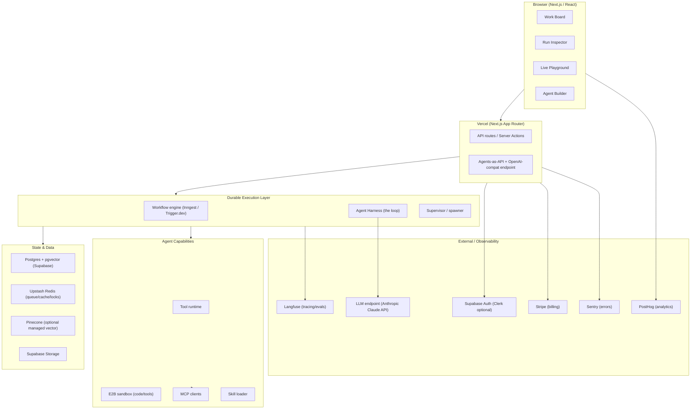

# DevPilot

## Technical Design Document (TDD)

**Version:** 0.1 (Draft — retained as living design-of-record; much of this is implemented)
**Status:** Implemented / living (originally "For review, June 2026"; see `docs/IMPLEMENTATION_STATUS.md` for planned-vs-built)
**Companion to:** DEVPILOT_PRD.md
**Last updated:** June 2026 (status annotations refreshed 2026-07-05)

---

## 1. Architecture Overview

DevPilot is a Next.js app on Vercel, backed by Postgres (Supabase) and a durable-execution engine that runs the actual agent loops. The LLM is the only hard external dependency; it sits behind a model-agnostic adapter so it can be swapped.

**Key idea:** the board, tickets, and agent state all live in Postgres. The durable-execution engine reads/writes that state and drives the harness. Because every step is checkpointed, a run can pause at `Input Required` for hours and resume on a webhook — the "works while offline" guarantee.

---

## 2. Tech Stack (OSS-first)

Every layer prefers open source; paid services are used only where there's no reasonable free/OSS option at MVP scale. The "Founders Pack" services are used as-is.

| Layer                       | Choice                                                     | OSS?  | License / Cost         | Why                                                                                                    |
| --------------------------- | ---------------------------------------------------------- | ----- | ---------------------- | ------------------------------------------------------------------------------------------------------ |
| **Frontend**                | Next.js + React + Tailwind + shadcn/ui                     | ✅    | MIT / Free             | Vercel-native; shadcn is OSS component base                                                            |
| **Hosting**                 | Vercel                                                     | ⚪    | Free tier              | In pack; serverless-native                                                                             |
| **Backend / DB**            | Supabase (Postgres)                                        | ✅    | Apache 2.0 / Free      | In pack; Postgres + Auth + Storage + Realtime + **pgvector** in one                                    |
| **Vector store**            | **pgvector** (primary) / Pinecone (optional)               | ✅/⚪ | Free                   | pgvector = one less dependency; Pinecone in pack as managed fallback                                   |
| **Cache / queue / locks**   | Upstash Redis                                              | ⚪    | Free tier              | In pack; serverless Redis                                                                              |
| **Durable execution**       | **Inngest** (pragmatic) or **Trigger.dev** (OSS self-host) | ⚪/✅ | Free tier / Apache 2.0 | The hard part — see §3.3                                                                               |
| **LLM adapter**             | **Vercel AI SDK**                                          | ✅    | Apache 2.0 / Free      | Provider-agnostic, tool calling, streaming; serves F-INT-06                                            |
| **Execution runners**       | API Runner (AI SDK) + **Claude Agent SDK** local runner    | ✅    | Apache 2.0 / Free      | BYO Claude Pro/Max subscription via `claude -p`; full file/bash/git tools (F-RUN-\*)                   |
| **LLM endpoint**            | Anthropic Claude API                                       | ⚪    | Usage-based            | The one hard dependency; abstracted by AI SDK                                                          |
| **Agent harness**           | Thin custom loop (+ optional Mastra)                       | ✅    | —                      | Keep control; honors "only the LLM endpoint." See §3.2                                                 |
| **Tracing / observability** | **Langfuse** (self-host or cloud free)                     | ✅    | MIT / Free             | OSS LLM-observability leader; OTel-compatible                                                          |
| **Code/tool sandbox**       | **E2B**                                                    | ✅    | Apache 2.0 / Free tier | Firecracker microVM sandboxes for untrusted code                                                       |
| **Eval harness**            | **Promptfoo** + Langfuse datasets                          | ✅    | MIT / Free             | Assertion + LLM-as-judge evals                                                                         |
| **Board drag-drop**         | **dnd-kit**                                                | ✅    | MIT / Free             | Kanban interactions                                                                                    |
| **Node-graph builder**      | **React Flow (@xyflow)**                                   | ✅    | MIT / Free             | Visual agent/workflow editor                                                                           |
| **Auth**                    | **Supabase Auth** (default) / Clerk (optional)             | ✅    | Apache 2.0 / Free      | Already in the stack via Supabase; one fewer vendor/bill. Clerk swappable later for richer org/RBAC UX |
| **Payments**                | Stripe                                                     | ⚪    | 2.9%/txn               | In pack                                                                                                |
| **Email**                   | Resend                                                     | ⚪    | Free tier              | In pack (notifications, escalations)                                                                   |
| **Error tracking**          | Sentry                                                     | ⚪    | Free tier              | In pack — ⚠️ **not yet wired** (0 imports, no dep as of 2026-07-05)                                    |
| **Product analytics**       | PostHog                                                    | ✅    | MIT / Free             | In pack; OSS, self-hostable — ⚠️ **not yet wired** (0 imports, no dep as of 2026-07-05)                |
| **DNS / CDN**               | Cloudflare                                                 | ⚪    | Free                   | In pack                                                                                                |
| **MCP**                     | Official MCP SDK                                           | ✅    | Open protocol          | Connector ecosystem for free                                                                           |

---

