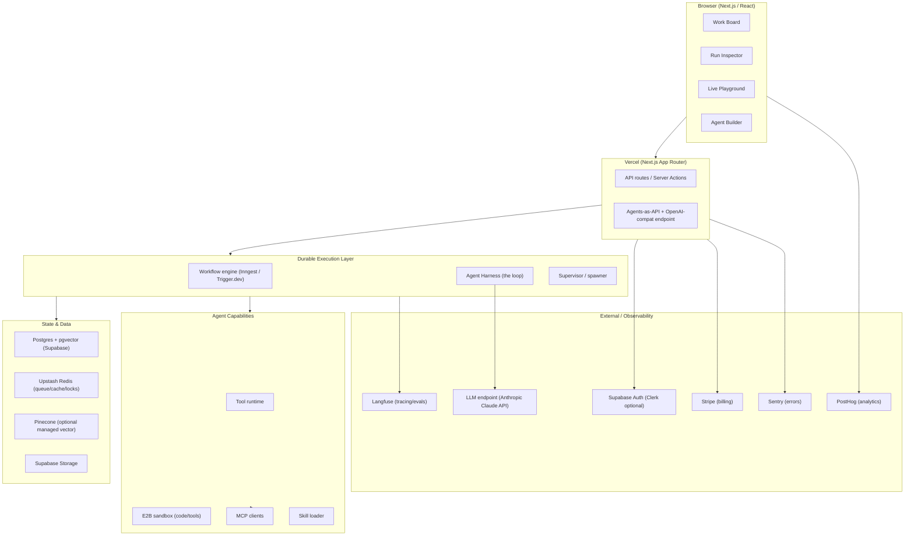

# DevPilot

## Technical Design Document (TDD)

**Version:** 0.1 (Draft — retained as living design-of-record; much of this is implemented)
**Status:** Implemented / living (originally "For review, June 2026"; see `docs/IMPLEMENTATION_STATUS.md` for planned-vs-built)
**Companion to:** DEVPILOT_PRD.md
**Last updated:** June 2026 (status annotations refreshed 2026-07-05)

---

## 1. Architecture Overview

DevPilot is a Next.js app on Vercel, backed by Postgres (Supabase) and a durable-execution engine that runs the actual agent loops. The LLM is the only hard external dependency; it sits behind a model-agnostic adapter so it can be swapped.

**Key idea:** the board, tickets, and agent state all live in Postgres. The durable-execution engine reads/writes that state and drives the harness. Because every step is checkpointed, a run can pause at `Input Required` for hours and resume on a webhook — the "works while offline" guarantee.

---

